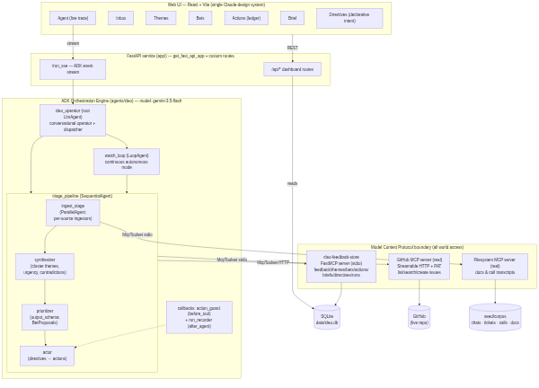
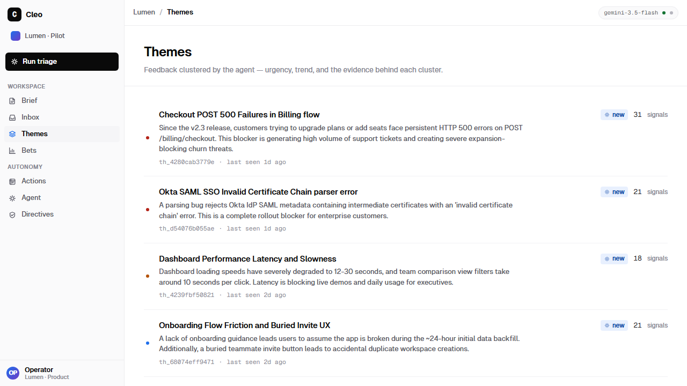
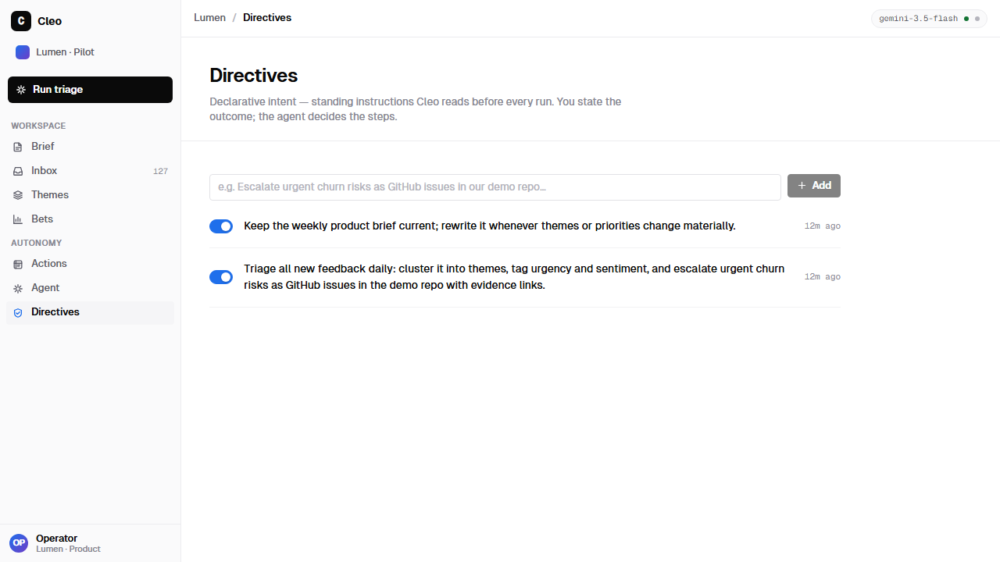
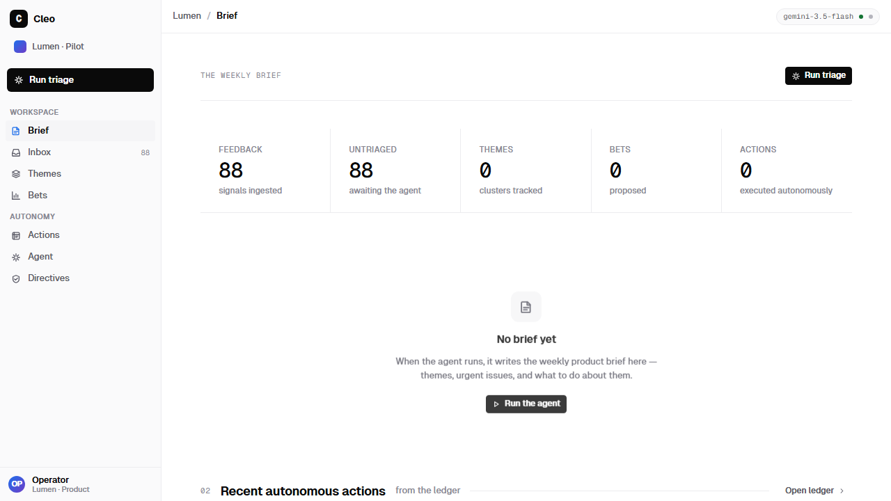
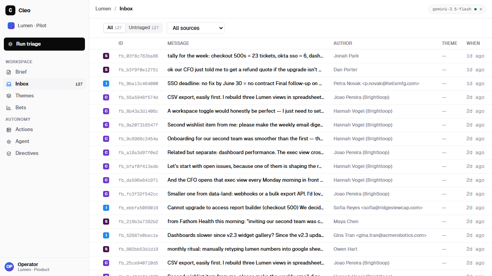

# Cleo — the autonomous product-feedback operator

**Built on the Agent Development Kit (ADK) · every connector speaks MCP · powered by `gemini-3.5-flash`**

## The problem

Startups get constant feedback from users across chats, tickets, calls and docs — but it sits
scattered and unused. Founders and PMs waste hours manually reading, tagging and guessing what
to build next, and still miss the real patterns and the urgent issues hiding in a Tuesday-night
Slack thread.

## The solution — declarative intent, not static code

You don't script Cleo. You give it a standing **directive**:

> *"Triage all new feedback. Escalate urgent churn risks as GitHub issues. Keep the weekly
> product brief current."*

and Cleo autonomously:

1. **Gathers** feedback through MCP connectors (GitHub issues, docs and call transcripts, chat
   and ticket exports) — in parallel.
2. **Synthesizes** it into themes: urgency, trends, sentiment, and genuine contradictions
   between customer segments.
3. **Prioritizes** evidence-backed product bets (structured output: impact / effort /
   confidence, every bet linked to the raw feedback that justifies it).
4. **Acts**: files real GitHub issues with evidence links, writes the weekly product brief —
   every action recorded in an auditable ledger with rationale, and gated by a guardrail
   callback so the agent can only do what a directive authorizes. **Autonomy with
   accountability.**

## Architecture



Full walkthrough + the source mermaid diagram: [`docs/ARCHITECTURE.md`](docs/ARCHITECTURE.md).

```
agents/cleo/   ADK orchestration engine (root operator, triage pipeline, watch loop)
mcp_server/    cleo-feedback-store — FastMCP stdio server over SQLite
app/           FastAPI service: ADK runner API (/run, /run_sse) + dashboard API + SPA
web/           single-design-system web UI (React + Vite + TS)
seed/          realistic multi-source demo corpus + seeder
tests/         offline test suite (no network, no LLM)
scripts/       live_smoke.py — end-to-end verification with real keys
```

## Screenshots

Themes below are **live agent output** — `gemini-3.5-flash` clustered ~90 raw multi-source
feedback items through MCP store tools and flagged the urgent ones itself:

| Themes (agent-synthesized) | Directives (declarative intent) |
|---|---|
|  |  |

| The weekly brief cockpit | Raw multi-source inbox |
|---|---|
|  |  |

## How we use ADK (the core concepts, not just the import)

| ADK concept | Where | Why |
|---|---|---|
| `LlmAgent` on `gemini-3.5-flash` | operator, ingestors, synthesizer, prioritizer, actor | the reasoning units |
| `SequentialAgent` | `triage_pipeline` | strict data dependencies between stages |
| `ParallelAgent` | `ingest_stage` | independent sources, concurrent pulls |
| `LoopAgent` | `watch_loop` | continuous autonomous mode, bounded iterations |
| `output_schema` (Pydantic) | prioritizer | bets as typed JSON, not prose |
| `output_key` + session state | stage hand-offs | no re-prompting between stages |
| `before_tool_callback` | `action_guard` | directives gate every external write |
| `after_agent_callback` | `run_recorder` | run ledger without polluting prompts |
| `McpToolset` (stdio + Streamable HTTP) | all world access | feedback store, filesystem, GitHub |
| `Runner` + `get_fast_api_app` | `app/main.py` | one process: agent API + dashboard + SPA |

## Quickstart

```bash
# 1. deps (Python 3.12+, uv, bun)
uv sync
cd web && bun install && cd ..

# 2. configure
cp .env.example .env   # add GOOGLE_API_KEY (and optionally GITHUB_TOKEN + GITHUB_DEMO_REPO)

# 3. seed the demo corpus (90+ feedback items across 5 sources)
uv run python -m seed.seed

# 4. run
uv run uvicorn app.main:app --port 8080     # API + agent
cd web && bun run dev                        # UI on http://localhost:5173

# 5. verify
uv run pytest -q                             # offline gate (no keys needed)
uv run python scripts/live_smoke.py          # full live pipeline (needs GOOGLE_API_KEY)
```

Model/GCP setup (AI Studio key or Vertex, plus Cloud Run deploy): [`docs/GCP_SETUP.md`](docs/GCP_SETUP.md).
3-minute demo script: [`docs/DEMO.md`](docs/DEMO.md).

## Security posture

The model never touches the database, filesystem, or GitHub directly — every effect crosses an
MCP tool boundary with narrow `tool_filter` allow-lists. External writes additionally pass the
directive-gated `action_guard` callback and land in the actions ledger with rationale +
evidence ids. Secrets stay in `.env`; the GitHub PAT is fine-grained to one demo repo.

## License

MIT
