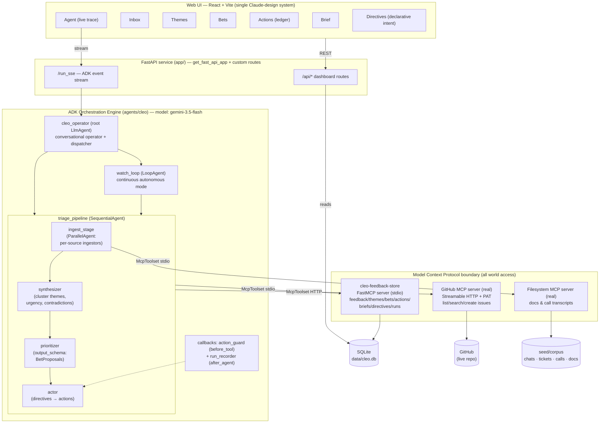

# Architecture

Cleo is a net-new autonomous agent: an **ADK orchestration engine** that touches the world
exclusively through **MCP**, driven by **declarative intent** (standing directives) rather
than imperative scripts, with every autonomous action recorded in an auditable ledger.

## Diagram

## The loop (what actually happens on a run)

1. A **directive** exists — e.g. *"Triage all new feedback; escalate urgent churn risks as
   GitHub issues; keep the weekly brief current."* This is the declarative intent: outcome,
   not procedure.
2. `cleo_operator` (or the `watch_loop` in continuous mode) launches `triage_pipeline`.
3. **Ingest** — `ParallelAgent` fans out one ingestor per source concurrently: GitHub issues
   via the GitHub MCP server, docs/call transcripts via the filesystem MCP server, chat/ticket
   exports already staged in the store. Everything lands as normalized `feedback` rows
   (deduped) via `cleo-feedback-store` MCP tools.
4. **Synthesize** — clusters feedback into `themes`, tags urgency/sentiment, flags
   contradictions; writes themes back through MCP. Summary flows to the next stage via ADK
   session state (`output_key="synthesis"`).
5. **Prioritize** — emits structured `BetProposals` (Pydantic `output_schema`; tool-free by
   ADK design, reading `{synthesis}` from state) — evidence-linked product bets with
   impact/effort/confidence.
6. **Act** — reads the directives, then executes: records every intended action in the
   `actions` ledger, files real GitHub issues (with evidence links back to feedback), writes
   the weekly brief. The `action_guard` callback gates every write tool call — no directive
   authorizing escalation ⇒ the call is blocked and recorded as `skipped`. Autonomy **with
   accountability**.
7. The UI's Agent view streams the whole run live from ADK's `/run_sse`; the Actions view
   shows the ledger; the Brief view shows the outcome.

## ADK concept map (what we used and why)

| ADK concept | Where | Why |
|---|---|---|
| `LlmAgent` (`gemini-3.5-flash`) | operator, ingestors, synthesizer, prioritizer, actor | reasoning units |
| `SequentialAgent` | `triage_pipeline` | the four stages have strict data dependencies |
| `ParallelAgent` | `ingest_stage` | sources are independent; concurrency is free wall-clock |
| `LoopAgent` | `watch_loop` | continuous autonomous mode with bounded iterations |
| `output_schema` (Pydantic) | prioritizer | bets must be machine-usable, not prose |
| `output_key` / session state | between all stages | typed hand-off without re-prompting |
| `before_tool_callback` | `action_guard` | hard guardrail: directives gate external writes |
| `after_agent_callback` | `run_recorder` | run ledger for the UI without polluting prompts |
| `McpToolset` (stdio) | feedback store, filesystem | the agent's only path to data |
| `McpToolset` (Streamable HTTP) | GitHub | real external connector, secured by PAT header |
| `Runner` + sessions | FastAPI service | programmatic execution + SSE event stream |
| `get_fast_api_app` | `app/main.py` | one process serves ADK API + dashboard API + SPA |

## Security posture

- The model never touches the DB, filesystem, or GitHub directly — every effect passes an MCP
  tool boundary with explicit, narrow tools (`tool_filter` allow-lists on external servers).
- GitHub writes additionally pass the `action_guard` callback (directive-gated) and are
  ledgered with rationale + evidence ids.
- Secrets live in `.env` (never committed); the GitHub PAT is fine-grained to the demo repo.
