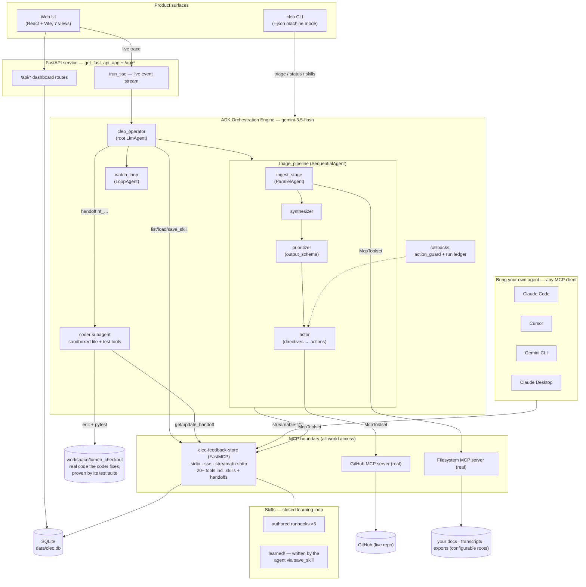

# Architecture

Cleo is a net-new autonomous agent platform: an **ADK orchestration engine** that touches the
world exclusively through **MCP**, driven by **declarative intent** (standing directives),
that **consults and extends its own skills**, and that can **dispatch a coding subagent** to
fix what the feedback says is broken — every autonomous effect recorded in an auditable ledger.

## Diagram

Rendered: [`docs/assets/architecture.png`](assets/architecture.png)

## The triage loop (what happens on a run)

1. A **directive** exists — e.g. *"Triage all new feedback; escalate urgent churn risks as
   GitHub issues; keep the weekly brief current."* Outcome, not procedure.
2. The operator consults its **skills**: `list_skills` → `load_skill("triage-feedback")` and
   follows the runbook, then launches `triage_pipeline` (or `watch_loop` for continuous mode).
3. **Ingest** — a `ParallelAgent` fans out one ingestor per source: GitHub issues via the
   GitHub MCP server, your transcripts/docs/exports via the filesystem MCP server (roots come
   from `cleo.config.json` — point it at your company's folders). Everything lands as
   normalized, deduped `feedback` rows through `cleo-feedback-store`.
4. **Synthesize** — clusters into `themes`, tags urgency/sentiment, flags contradictions.
5. **Prioritize** — emits structured `BetProposals` (Pydantic `output_schema`).
6. **Act** — reads the directives and executes: files evidence-linked GitHub issues, writes
   the weekly brief, ledgers every action. The `action_guard` callback blocks any write no
   directive authorizes.

## The fix loop (agent orchestrating an agent)

When a bet warrants a code change, the operator follows `fix-from-feedback`: it opens a
**handoff** (problem + evidence ids + testable acceptance criteria) and transfers to the
**coder subagent** — a separate `LlmAgent` with its own context and its own tools: sandboxed
file read/write confined to `workspace/` and a pytest runner. The coder reads the code, makes
the smallest fix, proves it by running the workspace test suite, closes the handoff with
files-changed + test evidence, and records a `code_fix` action. The demo target
(`workspace/lumen_checkout`) is a real FastAPI billing service whose v2.3 regression is the
same checkout-500 the feedback corpus complains about.

## The learning loop (skills)

Skills are versioned runbooks (`skills/*/SKILL.md`) the agents consult before any multi-step
task — and extend: after succeeding at a task no skill covered, the agent writes a
generalized procedure to `skills/learned/` via `save_skill`. Intelligence compounds across
runs instead of resetting each session.

## Product surfaces

- **Web UI** — Brief, Inbox, Themes, Bets, Actions (+ handoffs), Agent (live SSE trace),
  Directives.
- **`cleo` CLI** — `init / serve / mcp / triage / status / overview / skills / handoffs`,
  every command with `--json` for scripts and agents ([docs/CLI.md](CLI.md)).
- **Any MCP client** — the feedback store serves stdio, SSE, and streamable-http; Claude
  Code, Cursor, or Gemini CLI can operate Cleo directly
  ([docs/CONNECT_ANY_AGENT.md](CONNECT_ANY_AGENT.md)).

## ADK concept map (what we used and why)

| ADK concept | Where | Why |
|---|---|---|
| `LlmAgent` (`gemini-3.5-flash`) | operator, ingestors, synthesizer, prioritizer, actor, coder | reasoning units |
| `SequentialAgent` | `triage_pipeline` | strict data dependencies |
| `ParallelAgent` | `ingest_stage` | independent sources, concurrent MCP sessions |
| `LoopAgent` | `watch_loop` | bounded continuous autonomy |
| sub-agent transfer | operator → pipeline / coder | delegation with separate context + tools |
| `output_schema` (Pydantic) | prioritizer | typed bets, not prose |
| `output_key` / session state | stage hand-offs, `handoff_id` | no re-prompting |
| `before_tool_callback` | `action_guard` | directives gate external writes |
| `after_agent_callback` | run ledger | observability without prompt pollution |
| `McpToolset` (stdio + HTTP) | store, filesystem, GitHub | the only world access |
| FunctionTools | coder's sandboxed file/test tools | in-process containment |
| `Runner` + `get_fast_api_app` | `app/`, `cli/` | one engine, three surfaces |

## Security posture

- The model never touches the DB, filesystem, or GitHub directly — every effect crosses an
  MCP boundary with narrow `tool_filter` allow-lists, or a FunctionTool with explicit
  containment.
- The coder's file tools resolve every path against `workspace/` and reject everything else;
  its test runner is timeboxed and stripped of secrets.
- GitHub writes pass the directive-gated `action_guard` and land in the ledger with
  rationale + evidence ids. `save_skill` writes only under `skills/learned/` with
  kebab-validated names.
- Secrets live in `.env` (gitignored); the MCP HTTP transport binds localhost in demo scope.
